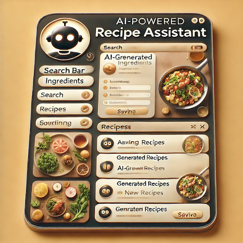

# **AI Recipe Finder**


## **Overview**  
The **AI Recipe Finder** helps users discover, generate, and save recipes. Users can search a **large-scale recipe database**, generate new recipes using **AI (LLMs - Llama3/Ollama)**, and save their favourites. Built with **Streamlit**, **SQLite**, and **Python**, this project demonstrates the integration of **data retrieval, AI-generated content, and user interaction** in a simple, scalable web application.

---

## **Features**  

### **Search & Discover Recipes**  
- Search a **database of 2M+ recipes** based on ingredients.  
- Returns **real-time, randomly selected** recipes.  

### **AI Recipe Generation**  
- Uses **LLMs (Llama3/Ollama)** to generate recipes based on input ingredients.  
- AI suggests structured recipes with **title, ingredients, and instructions**.  

### **Save & Manage Favourites**  
- Users can **save, view, and delete** favorite recipes.  
- Saved recipes are stored using **SQLite** for persistence.  

### **Streamlined UI & Performance**  
- **Simple, user-friendly interface** built with **Streamlit**.  
- **Optimized SQL queries** ensure efficient **recipe retrieval**.  

---

## **Technologies Used**  
- **Backend:** Python, SQLite  
- **Frontend:** Streamlit  
- **AI Model:** Ollama (Llama3)  
- **Deployment:** To be determined (Streamlit Cloud / GitHub Pages / Custom Hosting)  

---

## **Installation & Setup**  

### **1. Clone the Repository**  
```bash
git clone https://github.com/drnsmith/ai-recipe-finder.git
cd ai-recipe-finder
```

### **2. Install Dependencies**  
```bash
pip install -r requirements.txt
```

### **3. Run the Application**  
```bash
streamlit run dash3.py
```
The app will be available at **`http://localhost:8501`**.

---

## **How to Use**  

### ** Searching for a Recipe**  
1. Enter ingredients (e.g., `chicken, garlic`).  
2. Click **"Find Recipes"** to fetch a recipe from the database.  
3. Click **"Find Another Recipe"** to retrieve a different one.  

### ** Generating an AI Recipe**  
1. Enter ingredients.  
2. Click **"Generate AI Recipe"** for a new, AI-created recipe.  

### ** Saving & Managing Recipes**  
1. Click **"Save Recipe"** to store a recipe.  
2. View saved recipes under **"Saved Recipes"**.  
3. Click **"Remove"** to delete a saved recipe.  

---

## **Deployment Plan**  

**Step 1:** Push the updated repository to **GitHub** (ensure all latest code is included).  
**Step 2:** Deploy on **Streamlit Cloud** for easy access.  

---

## **Next Steps (Future Features)**  
- Improve search logic for **better recipe matching**.  
- Implement **recipe filtering (e.g., vegan, keto, gluten-free)**.  
- Add **real-time nutritional analysis** for recipes.  
- Deploy the project with **custom hosting**.  

---
### Contributing
Contributions are welcome! To contribute:
1. Fork the repository.
2. Create a feature branch: `git checkout -b feature-name`.
3. Commit your changes: `git commit -m 'Add feature-name'`.
4. Push to the branch: `git push origin feature-name`.
5. Open a pull request.

---
## Repository History Update

As part of preparing this repository for collaboration, its commit history has been updated. This action ensures a more streamlined project for contributors and removes outdated or redundant information in the history. 

The current state reflects the latest progress as of 17/03/2025.

For questions regarding prior work or additional details, please contact the author.

---

### License
This project is licensed under the MIT License. See the [LICENSE](LICENSE) file for details.

